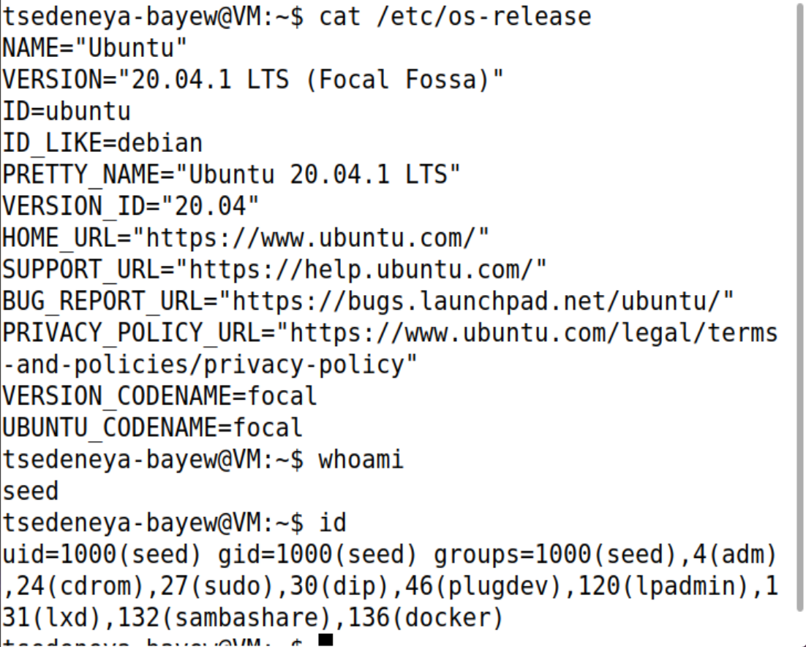

# Linux Users & File Permissions

**Level:** Beginner · **Suggested time:** 1–2 hours · **Status:** In progress

> Lab in progress. Step 1 is documented below; Steps 2–6 are not yet evidenced.

[← Project index](../../README.md)

## Objective

Complete a reproducible linux users & file permissions exercise, validate the behavior, and explain the evidence and limitations in a professional report.

## Environment and prerequisites

Ubuntu desktop VM; 2 GB RAM minimum, 4 GB preferred; local sudo access. Use a disposable VM and take a snapshot before creating accounts.

## How to use this repository

1. Read the environment and scope before starting. Use a disposable VM for administrative changes.
2. Follow steps in order. Record actual output; expected results are predictions, not completed evidence.
3. Save screenshots using the exact filenames shown below in `screenshots/`.
4. Add each image under its step using ``. Step 1 evidence is included below; add later screenshots as you complete the lab.
5. Complete [your findings report](reports/findings.md). Record deviations and failed checks honestly.
6. Change **Not started** to **In progress** when you begin. Mark **Completed** only after your evidence and report are committed.

For browser uploads: open the destination folder → Add file → Upload files → select your sanitized files → Commit changes. To edit Markdown: open the file → pencil icon → edit → preview → commit with a descriptive message. Do not upload passwords, tokens, personal identifiers, or unrelated logs.

## Step-by-step lab

### 1. Record your environment

Open a terminal in your Ubuntu VM. Run:
```bash
cat /etc/os-release
whoami
id
```
Record Ubuntu version and the groups listed by `id`. `sudo` runs a single command as administrator; do not use a persistent root shell.

**Screenshot checkpoint:** 01-environment.png: OS version and group membership, with identifying details redacted.



**Observed result:** The VM reports Ubuntu 20.04.1 LTS (Focal Fossa). `whoami` returns `seed`; `id` reports UID 1000, primary GID 1000, and membership in `adm`, `cdrom`, `sudo`, `dip`, `plugdev`, `lpadmin`, `lxd`, `sambashare`, and `docker`. The displayed `tsedeneya-bayew@VM` prompt is customized and does not rename the actual account. Step 1 is complete; permission changes and access tests remain pending.

### 2. Create two lab users and one group

```bash
sudo groupadd portfolio_lab
sudo useradd -m -s /bin/bash portfolio_reader
sudo useradd -m -s /bin/bash portfolio_outsider
sudo usermod -aG portfolio_lab portfolio_reader
id portfolio_reader
id portfolio_outsider
```
`-m` creates a home directory; `-s` selects a shell; `-aG` adds a supplementary group without removing other memberships. If a name already exists, inspect it and use a new lab-only name rather than modifying an existing account.

**Screenshot checkpoint:** 02-users.png: reader belongs to portfolio_lab; outsider does not.

### 3. Create a least-privilege directory

```bash
sudo mkdir -p /opt/portfolio-permissions
printf 'Synthetic lab evidence only\n' | sudo tee /opt/portfolio-permissions/evidence.txt
sudo chown root:portfolio_lab /opt/portfolio-permissions
sudo chown root:portfolio_lab /opt/portfolio-permissions/evidence.txt
sudo chmod 750 /opt/portfolio-permissions
sudo chmod 640 /opt/portfolio-permissions/evidence.txt
ls -ld /opt/portfolio-permissions
ls -l /opt/portfolio-permissions/evidence.txt
```
Permissions use read=4, write=2, execute=1. `750` grants the owner rwx, the group r-x, and others no access. Directory execute allows traversal. `640` grants owner rw-, group r--, and others no access.

**Screenshot checkpoint:** 03-permissions.png: directory and file ownership and modes.

### 4. Verify allowed and denied access

```bash
sudo -u portfolio_reader cat /opt/portfolio-permissions/evidence.txt
sudo -u portfolio_outsider cat /opt/portfolio-permissions/evidence.txt
sudo -u portfolio_reader sh -c 'echo change >> /opt/portfolio-permissions/evidence.txt'
```
Expected: reader can read; outsider receives Permission denied; reader cannot append. A denied operation is useful evidence, not a failed lab. Record actual exit codes with `echo $?` immediately after each command.

**Screenshot checkpoint:** 04-access-tests.png: all three tests and their results.

### 5. Demonstrate the effect of a controlled change

```bash
sudo chmod 660 /opt/portfolio-permissions/evidence.txt
sudo -u portfolio_reader sh -c 'echo approved-lab-change >> /opt/portfolio-permissions/evidence.txt'
sudo chmod 640 /opt/portfolio-permissions/evidence.txt
sudo -u portfolio_reader cat /opt/portfolio-permissions/evidence.txt
```
Group write temporarily permits the append. Restore 640 immediately. Explain why a world-writable mode such as 777 is unnecessary.

**Screenshot checkpoint:** 05-controlled-change.png: successful append and restored mode.

### 6. Document and restore

Fill `reports/findings.md` with your access matrix: owner, group member, outsider; read and write outcomes. Revert the VM snapshot when finished, or retain the VM for later labs. Do not delete real users or directories as cleanup.

**Screenshot checkpoint:** 06-summary.png: final permission settings.

## Troubleshooting

If sudo reports no permission, use a VM account created with administrator rights. If the reader is denied, check both directory traversal and file permissions with `namei -l /opt/portfolio-permissions/evidence.txt`. The sudo -u tests use a fresh process, so a new login is not required.

## Questions to answer in your report

- Why does a directory need execute permission to access files?
- What risk does group-write introduce?
- How do ownership and permissions support least privilege?

## Completion checklist

- [ ] Environment and exact scope recorded
- [ ] All lab steps attempted and actual outcomes documented
- [ ] Screenshots uploaded and linked under their steps
- [ ] Findings distinguish observation from interpretation
- [ ] Limitations and remediation explained
- [ ] Cleanup or restoration completed
- [ ] Findings report completed; status updated in this repository and portfolio index

## Official references

- https://manpages.ubuntu.com/manpages/noble/en/man1/chmod.1.html
