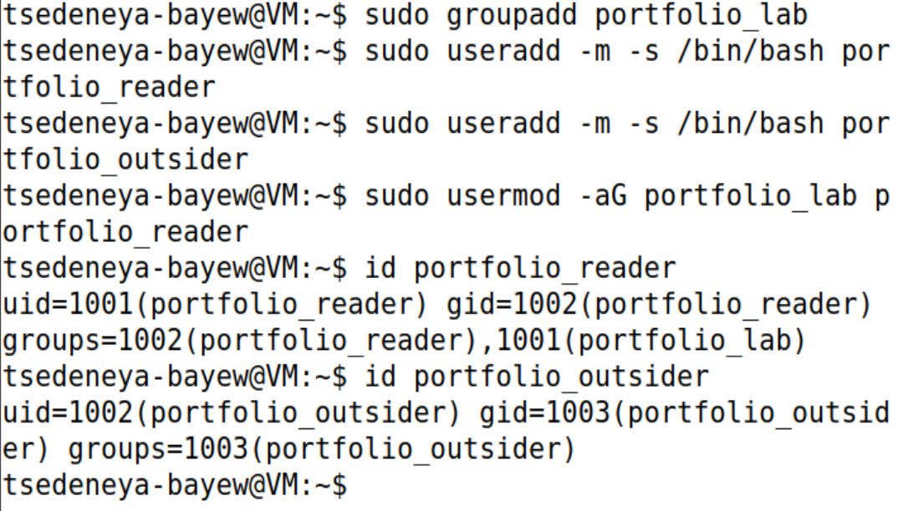
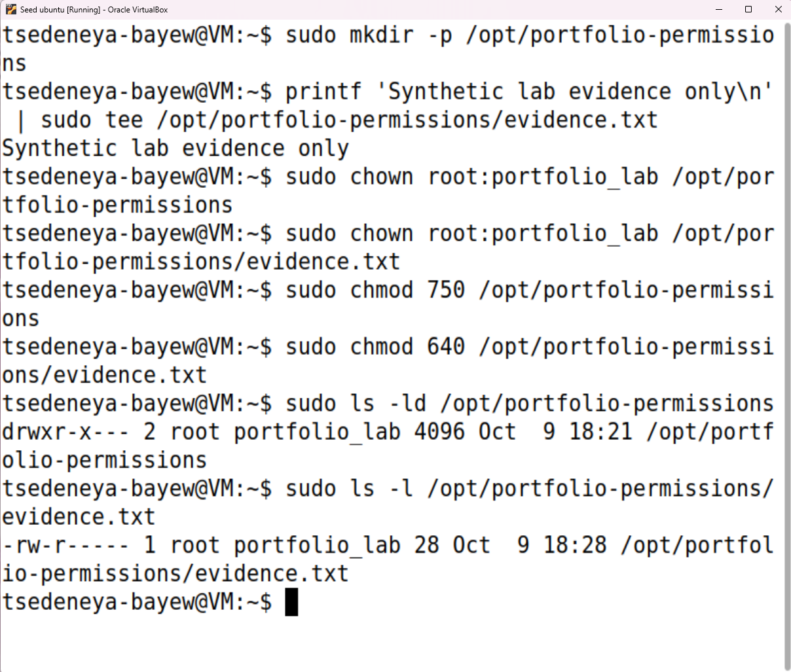
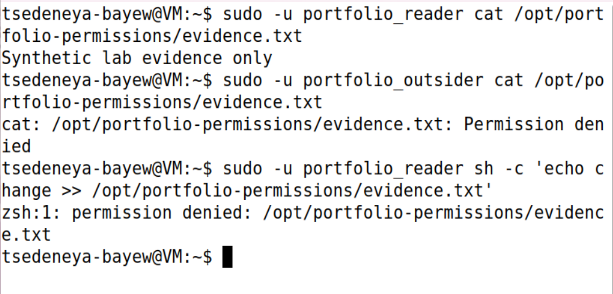
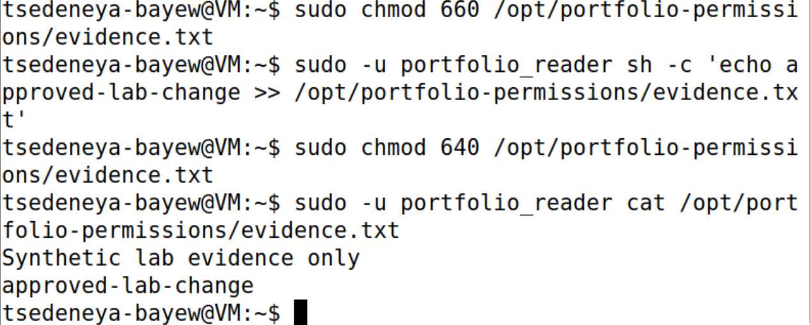
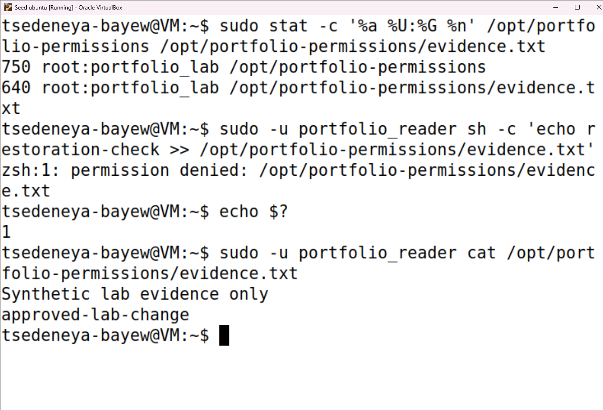

# Linux Users & File Permissions — Findings Report

**Status:** In progress  
**Started:** October 9, 2026 (first screenshot submitted)  
**Completed:** Not yet completed

> Partial report based on the supplied Steps 1–6 screenshots. Technical checks are complete; VM retention or snapshot restoration remains undocumented.

## Progress summary

Environment inspection and lab account setup are documented. The second screenshot confirms two distinct lab users and membership of `portfolio_reader` in `portfolio_lab`; `portfolio_outsider` is not in that group. Step 3 confirms the directory is `750` and the file is `640`, both owned by `root:portfolio_lab`. Step 4 shows successful reader access, denied outsider read access, and a denied reader append attempt. Step 5 records a temporary change to `660`, a successful reader append, and a command to restore `640`. Step 6 confirms final modes (`750` directory, `640` file), denies reader writing with exit code `1`, and confirms the expected two-line contents.

## Environment and authorized scope

| Item | Observed value |
|---|---|
| OS and version | Ubuntu 20.04.1 LTS (Focal Fossa); VERSION_ID 20.04 |
| Actual account | seed |
| UID / primary GID | 1000 / 1000 (seed) |
| Supplementary groups shown | adm (4), cdrom (24), sudo (27), dip (30), plugdev (46), lpadmin (120), lxd (131), sambashare (132), docker (136) |
| Terminal prompt | tsedeneya-bayew@VM; customized display |
| Hypervisor shown | Oracle VirtualBox; version not captured |
| Scope | User-provided Ubuntu VM for this lab |
| Tools used so far | cat, whoami, id, sudo, groupadd, useradd, usermod, mkdir, printf, tee, chown, chmod, ls, sh, echo; versions not captured |
| Snapshot / recovery plan | Not yet documented |
| VM CPU / RAM / disk | Not shown in screenshot |
| Timezone | Not shown in screenshot |

## Evidence log

| Step | Command | Actual result | Evidence | Interpretation |
|---|---|---|---|---|
| 1 | `cat /etc/os-release` | Ubuntu 20.04.1 LTS; codename focal | [Environment screenshot](../screenshots/01-environment.png) | Establishes the release label reported by the VM. |
| 1 | `whoami` | seed | [Environment screenshot](../screenshots/01-environment.png) | The effective account name is seed, despite the customized prompt. |
| 1 | `id` | UID/GID 1000; groups listed above | [Environment screenshot](../screenshots/01-environment.png) | Records current identity and group membership. |
| 2 | `sudo groupadd portfolio_lab` | No visible error; subsequent reader output includes portfolio_lab (GID 1001) | [User setup screenshot](../screenshots/02-users.png) | Lab group exists at verification time. |
| 2 | `sudo useradd -m -s /bin/bash portfolio_reader` and equivalent outsider command | No visible errors; both accounts are resolved by id | [User setup screenshot](../screenshots/02-users.png) | Accounts exist; home directories and shells were not independently checked. |
| 2 | `sudo usermod -aG portfolio_lab portfolio_reader`; `id portfolio_reader` | UID 1001; primary GID 1002; groups portfolio_reader (1002), portfolio_lab (1001) | [User setup screenshot](../screenshots/02-users.png) | Reader has the required supplementary group membership. |
| 2 | `id portfolio_outsider` | UID 1002; primary GID 1003; only portfolio_outsider (1003) listed | [User setup screenshot](../screenshots/02-users.png) | Outsider is not a member of portfolio_lab. |
| 3 | `sudo mkdir -p`; `printf ...` piped to `sudo tee` | No visible errors; tee displays Synthetic lab evidence only | [Permissions screenshot](../screenshots/03-permissions.png) | Synthetic evidence file was written. |
| 3 | `sudo chown root:portfolio_lab`; `sudo chmod 750` / `640` | No visible errors; final listings below verify settings | [Permissions screenshot](../screenshots/03-permissions.png) | Requested ownership and modes are confirmed by inspection. |
| 3 | `sudo ls -ld /opt/portfolio-permissions` | drwxr-x---; root portfolio_lab | [Permissions screenshot](../screenshots/03-permissions.png) | Directory mode 750: owner rwx, group r-x, others no access. |
| 3 | `sudo ls -l /opt/portfolio-permissions/evidence.txt` | -rw-r-----; root portfolio_lab; 28 bytes | [Permissions screenshot](../screenshots/03-permissions.png) | File mode 640: owner read/write, group read, others no access. |
| 4 | `sudo -u portfolio_reader cat /opt/portfolio-permissions/evidence.txt` | Synthetic lab evidence only | [Access-test screenshot](../screenshots/04-access-tests.png) | Group member can read the file. |
| 4 | `sudo -u portfolio_outsider cat /opt/portfolio-permissions/evidence.txt` | Permission denied | [Access-test screenshot](../screenshots/04-access-tests.png) | Outsider read attempt is blocked. |
| 4 | `sudo -u portfolio_reader sh -c 'echo change >> /opt/portfolio-permissions/evidence.txt'` | zsh:1: permission denied for the file path | [Access-test screenshot](../screenshots/04-access-tests.png) | Reader append attempt is blocked. Exit codes were not captured. |
| 5 | `sudo chmod 660 /opt/portfolio-permissions/evidence.txt` | No visible error | [Controlled-change screenshot](../screenshots/05-controlled-change.png) | Temporary group-write setting requested; no intermediate mode listing shown. |
| 5 | Reader append of `approved-lab-change` via `sh -c` | No visible error; subsequent cat includes appended line | [Controlled-change screenshot](../screenshots/05-controlled-change.png) | Reader append succeeded during the controlled change. |
| 5 | `sudo chmod 640 /opt/portfolio-permissions/evidence.txt` | No visible error | [Controlled-change screenshot](../screenshots/05-controlled-change.png) | Restore command recorded; final mode and write restriction are verified in Step 6. |
| 5 | `sudo -u portfolio_reader cat /opt/portfolio-permissions/evidence.txt` | Synthetic lab evidence only, followed by approved-lab-change | [Controlled-change screenshot](../screenshots/05-controlled-change.png) | Reader retains read access and the appended content is present. |
| 6 | `sudo stat -c '%a %U:%G %n'` on directory and file | 750 root:portfolio_lab for directory; 640 root:portfolio_lab for file | [Final verification screenshot](../screenshots/06-summary.png) | Final ownership and restrictive modes verified. |
| 6 | Reader append of `restoration-check`; immediate `echo $?` | Permission denied; exit code 1 | [Final verification screenshot](../screenshots/06-summary.png) | Reader write is blocked after restoration. |
| 6 | Reader cat of evidence.txt | Original synthetic line and approved-lab-change only | [Final verification screenshot](../screenshots/06-summary.png) | Read access persists; denied append did not add restoration-check. |

## Observations

### OS baseline recorded

The release information identifies Ubuntu 20.04.1 LTS (Focal Fossa). This screenshot does not establish installed package versions, patch status, support entitlement, or whether updates have been applied.

### Account identity differs from the displayed prompt

The prompt displays `tsedeneya-bayew@VM`, while `whoami` returns `seed`. The prompt was customized for the portfolio; it is not evidence of an account rename. Account-related commands should use the actual account where required.

### Group membership recorded

The account belongs to `sudo`, along with the other groups in the environment table. Step 1 records membership only. Step 2 shows administrative account-management commands with no visible errors, followed by the expected account and group output. This supports successful lab setup; it does not establish unrestricted sudo policy.

### Lab identities verified

The reader and outsider have distinct UIDs and primary groups. Only the reader belongs to `portfolio_lab`, providing the intended identities for later access tests. Membership alone does not prove read or write access; directory and file permissions must still be configured and tested.

### Restricted directory and file configured

The final listings confirm `root:portfolio_lab` ownership on both objects. Mode `750` allows the group to list and traverse the directory; mode `640` grants the group file-read permission without file-write permission. Step 4 verifies the intended behavior for the tested reader and outsider operations.

### Read access allowed; outsider access and group write blocked

The reader prints the synthetic file text, while the outsider's read and reader's append both produce permission-denied messages. These are successful negative tests of the restrictions, not setup failures. The outsider denial is consistent with lack of directory traversal permission; the reader can traverse and read, but lacks file-write permission.

### Temporary group write demonstrated

The reader could not append under the Step 4 restrictions. After the command to set `660`, the reader appends `approved-lab-change`, confirmed by the subsequent file contents. Group-write permission allows a group member to modify evidence, creating an integrity risk if left enabled unnecessarily. Granting group write for this controlled test avoids granting access to all users with `777`. Step 6 confirms restoration to `640` and a repeat denied-write test with exit code `1`.

## Access matrix — observed tests

| Identity | Read | Append / write | Evidence |
|---|---|---|---|
| root (owner) | Not explicitly tested | File creation via sudo tee shown in Step 3 | Step 3 screenshot |
| portfolio_reader (group member) | Allowed in Steps 4 and 5 | Denied in Step 4; allowed during Step 5 temporary group-write test; denied after restoration in Step 6 (exit code 1) | Steps 4–6 screenshots |
| portfolio_outsider (nonmember) | Denied | Not tested | Step 4 screenshot |

## Deviations and troubleshooting

### Step 3 verification command corrected

The next supplied screenshot shows `ls -ld /opt/portfolio-permissions` returning `drwxr-x---`, owned by `root:portfolio_lab`, matching directory mode `750`. The subsequent unprivileged `ls -l /opt/portfolio-permissions/evidence.txt` returns `Permission denied`. The current account `seed` was not listed as a member of `portfolio_lab` in Step 1, so this is consistent with the directory blocking traversal for other users. The guide omitted `sudo` from its inspection commands; those commands have been corrected. The subsequent Step 3 screenshot shows both corrected `sudo ls` commands and confirms directory mode `750` and file mode `640`. The inspection issue is resolved; Step 3 is complete.

The terminal prompt is customized; the report retains the actual account identity from command output. No errors are visible in the environment or account-setup commands. Exit codes were not captured.

### Step 4 expected denials and shell message

Both permission-denied messages match the test expectations. No permission widening is required. The write command visibly uses `sh -c`, but the error prefix is `zsh:1`; the shell mapping or implementation was not inspected, so no explanation of that prefix is asserted. Step 4 exit codes are not shown and must not be inferred as exact numeric values. Step 6 separately captures exit code `1` for the post-restoration denied append.

## Validation

- **Documented:** OS release inspection, current account inspection, UID/GID and group inspection; lab group/account setup and reader/outsider membership verification; directory and file ownership/mode verification; reader read allowed, outsider read denied, reader append denied in Step 4; successful controlled append and retained read access in Step 5; final modes and denied post-restoration append (exit code 1) in Step 6.
- **Pending:** Document VM retention or snapshot restoration. Technical validation is complete.

## Limitations

All six technical steps are evidenced. The screenshots do not prove hypervisor settings, snapshot creation, resource allocation, home-directory creation, configured login shells, or the shell implementation. Step 1–5 exit codes, outsider write behavior, and a separate root read test are not shown. Step 5 has no intermediate `660` mode listing; successful append is confirmed by file contents. Step 6 verifies final `640` and denied writing with exit code `1`. No vulnerability or remediation finding is claimed.

## Cleanup / restoration

Step 5 shows the file-mode restore command (`chmod 640`); Step 6 independently confirms final mode `640`, directory mode `750`, and blocked reader writing. No VM cleanup is documented yet. The lab users and group remain present in the supplied evidence. Account removal or VM snapshot restoration has not been shown; the lab directory and file now have the documented ownership and modes.

## Lessons learned so far

- The visible shell prompt can differ from the actual account name.
- `whoami` and `id` provide account identity and group evidence.
- OS identification is a baseline, not proof of patch status.
- `id username` verifies primary and supplementary group memberships.
- Group membership prepares an access-control test; actual access requires separate validation.
- Temporary group write permits modification; remove it when the approved change is finished and verify restoration.
- Expected permission denials provide evidence that access restrictions are enforced.
- Restricted directory traversal can block an ordinary account from inspecting a file; privileged inspection can verify settings without widening permissions.

## Remaining work

- [x] Step 1: record environment
- [x] Step 2: create two lab users and one group
- [x] Step 3: create least-privilege directory and file
- [x] Step 4: verify allowed and denied access
- [x] Step 5: demonstrate a controlled permission change
- [x] Step 6: verify final settings and denied writing; technical findings documented
- [ ] Record VM retention or snapshot restoration decision

## Answers to the report questions

- **Why directory execute matters:** Execute permission on a directory allows traversal to entries. A readable file remains inaccessible through a directory the user cannot traverse.
- **Risk of group write:** Group members can modify file contents, affecting integrity. Step 5 demonstrates this with a controlled append; Step 6 verifies write restriction after restoring `640`.
- **Least privilege:** `root:portfolio_lab` ownership with directory `750` and file `640` grants the lab group traversal and read access while withholding file write and excluding nonmembers. The tested outcomes support these specific restrictions; they do not constitute a full system security audit.

## Technical conclusion

The lab demonstrates account/group setup, restricted ownership and modes, allowed and denied access, a controlled permission change, and verified restoration. Final reader access is read-only in the tested operations. The lab users, group, directory, and synthetic file remain present in the final screenshot; VM retention or snapshot rollback must be documented before administrative closeout.
