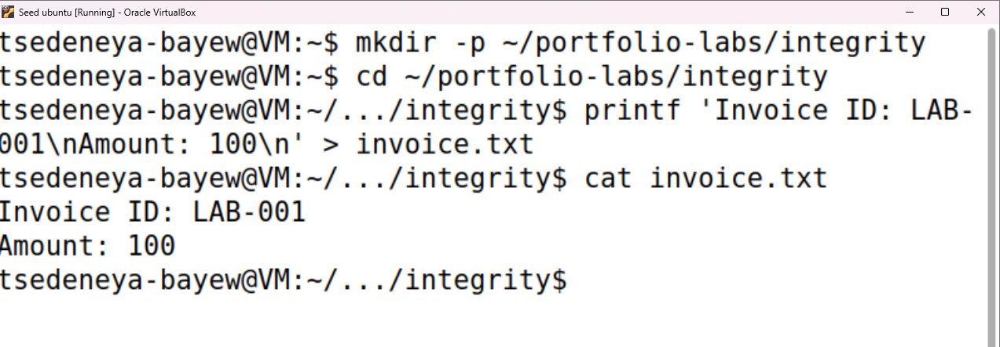
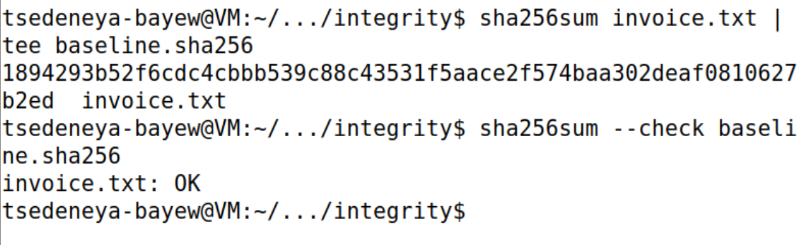
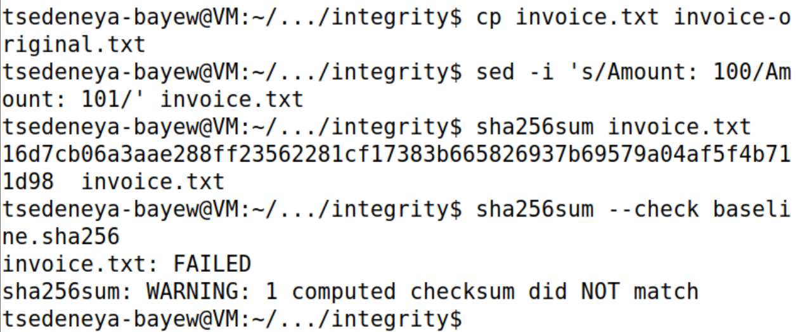
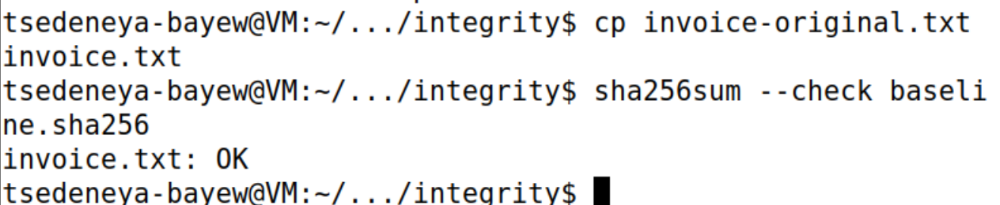
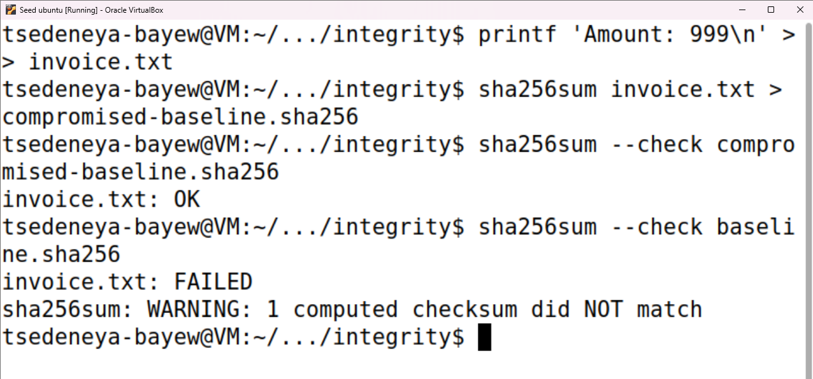
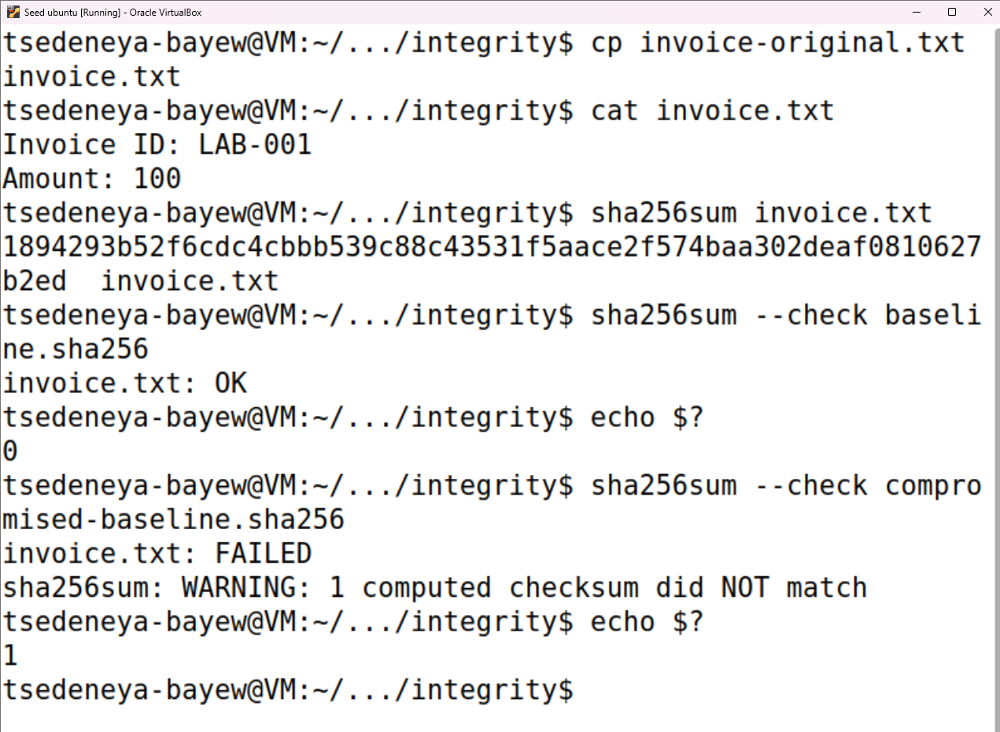

# File Integrity with SHA-256 — Findings Report

**Status:** Completed  
**Started:** October 9, 2026 (first screenshot submitted)  
**Completed:** October 9, 2026

> Completed report based on all six supplied screenshots.

## Progress summary

The synthetic invoice was created and its visible contents verified. Step 2 records the original SHA-256 digest and a passing baseline check (`invoice.txt: OK`). Step 3 records a changed digest and an expected failed comparison with the original baseline. Step 4 restores the backup and passes the original baseline check. Step 5 demonstrates that a baseline generated from modified data passes while the original baseline fails. Step 6 restores the original contents and digest; the original baseline passes with exit code `0`, while the changed-data baseline fails with exit code `1`.

## Environment and authorized scope

| Item | Observed value |
|---|---|
| Platform | Ubuntu VM shown running in Oracle VirtualBox; release and tool versions not shown in this screenshot |
| Prompt | tsedeneya-bayew@VM; customized display |
| Working directory | Commands target ~/portfolio-labs/integrity; prompt shows an abbreviated path ending in integrity |
| Target | invoice.txt, a fictional lab invoice |
| Tools used so far | mkdir, cd, printf, cat, sha256sum, tee, cp, sed; versions not captured |
| Snapshot / recovery plan | Not documented for this project |
| Timezone | Not shown |

## Evidence log

| Step | Command or action | Actual result | Evidence | Interpretation |
|---|---|---|---|---|
| 1 | mkdir -p ~/portfolio-labs/integrity; cd into that directory | No visible errors; prompt ends in integrity | [Original invoice screenshot](../screenshots/01-original.png) | Lab working directory established. |
| 1 | printf writes the fictional invoice to invoice.txt | No visible error | [Original invoice screenshot](../screenshots/01-original.png) | File creation command recorded. |
| 1 | cat invoice.txt | Invoice ID: LAB-001 and Amount: 100 on separate lines | [Original invoice screenshot](../screenshots/01-original.png) | Visible contents match the intended synthetic starting data. |
| 2 | `sha256sum invoice.txt` piped to `tee baseline.sha256` | Original digest recorded below | [Baseline screenshot](../screenshots/02-baseline.png) | Baseline generation and displayed digest recorded. |
| 2 | `sha256sum --check baseline.sha256` | invoice.txt: OK | [Baseline screenshot](../screenshots/02-baseline.png) | Current file matches the stored baseline digest. |
| 3 | `cp invoice.txt invoice-original.txt`; substitution of Amount: 100 with Amount: 101 | No visible errors | [Modification screenshot](../screenshots/03-tamper-detected.png) | Backup and controlled edit commands recorded; changed contents not separately displayed. |
| 3 | `sha256sum invoice.txt` | Changed digest recorded below | [Modification screenshot](../screenshots/03-tamper-detected.png) | Digest differs from Step 2 baseline. |
| 3 | `sha256sum --check baseline.sha256` | invoice.txt: FAILED; WARNING: 1 computed checksum did NOT match | [Modification screenshot](../screenshots/03-tamper-detected.png) | Original baseline detects the modified file. Exact exit code not shown. |
| 4 | `cp invoice-original.txt invoice.txt` | No visible error | [Restoration screenshot](../screenshots/04-restored.png) | Backup restored to the monitored file. |
| 4 | `sha256sum --check baseline.sha256` | invoice.txt: OK | [Restoration screenshot](../screenshots/04-restored.png) | Restored file matches the original baseline digest; numeric exit code not shown. |
| 5 | Append Amount: 999; generate compromised-baseline.sha256 | No visible errors | [Trust-limit screenshot](../screenshots/05-trust-limit.png) | New comparison baseline is generated from the modified data. |
| 5 | Check compromised-baseline.sha256 | invoice.txt: OK | [Trust-limit screenshot](../screenshots/05-trust-limit.png) | Modified data matches its newly generated baseline. |
| 5 | Check original baseline.sha256 | invoice.txt: FAILED; one computed checksum did NOT match | [Trust-limit screenshot](../screenshots/05-trust-limit.png) | Original baseline still detects the difference. Exit codes not shown. |
| 6 | Restore backup; cat invoice.txt; sha256sum invoice.txt | Invoice ID: LAB-001, Amount: 100; original digest reproduced | [Final screenshot](../screenshots/06-summary.png) | Original content restored and hash verified. |
| 6 | Check baseline.sha256; immediate echo $? | invoice.txt: OK; 0 | [Final screenshot](../screenshots/06-summary.png) | Original baseline comparison succeeds. |
| 6 | Check compromised-baseline.sha256; immediate echo $? | invoice.txt: FAILED; mismatch warning; 1 | [Final screenshot](../screenshots/06-summary.png) | Changed-data baseline correctly mismatches restored data. |













## Changed SHA-256 digest

```text
16d7cb06a3aae288ff23562281cf17383b665826937b69579a04af5f4b711d98
```

## Original SHA-256 digest

```text
1894293b52f6cdc4cbbb539c88c43531f5aace2f574baa302deaf0810627b2ed
```

## Observations

The initial and final screenshots show the expected fictional invoice identifier and amount. The shown `printf` command specifies newline separators. Step 2 records a 64-character SHA-256 digest and a passing check against `baseline.sha256`. No independent byte count is shown. The matching check supports consistency with the recorded baseline at that moment; it does not establish authorship or independently trusted baseline storage.

### Controlled modification detected

The edit command requests changing `Amount: 100` to `Amount: 101`. The resulting digest differs from the recorded original digest, and the original baseline check fails with a checksum-mismatch warning. This confirms detection of changed bytes; it does not establish who changed them or whether a change was malicious. A separate `cat` of the modified file and exact exit code were not captured.

### Original baseline matches after restoration

Copying the backup back to `invoice.txt` is followed by `invoice.txt: OK` against the original baseline. This supports successful restoration to bytes matching the recorded original digest. The Step 4 screenshot does not separately display restored contents or a numeric exit code. Step 6 supplies those checks, reproduces the original digest, and captures exit code `0` for the original baseline.

### Baseline trust limitation demonstrated

The lab appends `Amount: 999` and generates a second baseline from the changed data. That baseline passes, while the original baseline fails. This demonstrates that a matching checksum can be obtained for altered data when the comparison baseline is also generated from it. The demonstration uses a separate baseline file; it does not show an actual attacker, compromise, or overwrite of the original baseline. Protect baseline authenticity and storage separately from monitored data; a bare local hash comparison cannot establish authorship or prevent modification.

## Deviations and troubleshooting

No visible command errors or deviations from Steps 1–2. The Step 3 failure is expected after the edit. Step 1–5 exit codes were not captured. Step 6 captures `0` for the original baseline and `1` for the changed-data baseline.

## Validation

- **Documented:** Synthetic file creation, visible content inspection, original digest, passing baseline comparison, changed digest, and failed comparison after modification, and passing original-baseline check after restoration in Step 4, and contrasting baseline results in Step 5.
- **Final verification:** Original contents and digest restored; original baseline passes (`0`), changed-data baseline fails (`1`). All six lab steps are documented.

## Limitations

This evidence establishes visible starting content and a match to the locally generated digest baseline. It does not establish authorship, independent baseline trust, or attribution of the observed modification. Step 3 does show detection of a checksum mismatch. OS release and tool versions were not captured in this project's screenshots. The digest for the appended Step 5 data is not displayed, and exact exit codes for Steps 1–5 remain unrecorded.

## Cleanup / restoration

The synthetic file and lab directory are present in Step 1; baseline.sha256 is generated in Step 2. Step 3 records a backup command to invoice-original.txt and modifies invoice.txt; Step 4 records successful backup restoration as validated against the original baseline. Step 4 restoration is verified. Step 5 subsequently modifies the file again; Step 6 restores the original invoice and confirms the original digest and baseline match. The synthetic lab artifacts remain present, consistent with the author's decision to retain the VM for future projects. Only synthetic artifacts are used.

## Lessons learned

- `printf` creates controlled synthetic content and `cat` checks the visible text.
- `sha256sum --check` compares the current file against the digest recorded in the baseline.
- A matching local baseline does not prove authorship or that the baseline is protected.

## Completion review

- [x] Step 1: create synthetic data
- [x] Step 2: establish a baseline
- [x] Step 3: change a value and detect the mismatch
- [x] Step 4: restore and recheck
- [x] Step 5: demonstrate baseline trust limitations
- [x] Step 6: complete the report and final verification

## Answers to the report questions

- **Does a matching hash prove authorship?** No. It establishes a match to the recorded comparison digest; it does not identify the creator or independently authenticate the baseline.
- **Where should the baseline be stored?** Store it separately with access controls that prevent whoever can change the monitored data from changing the trusted reference. Signed manifests or authenticated hashes can strengthen trust if verification keys or secrets are protected. These protections were discussed, not implemented in this lab.
- **Why does a small byte change alter the digest?** SHA-256 combines all input bytes into a fixed-length digest. Its design makes a small input change typically produce a substantially different digest; the change from 100 to 101 produced the distinct digest recorded above.

## Conclusion

This lab demonstrates baseline creation, modification detection, recovery, and the trust limitation of a baseline generated from changed data. Final restoration reproduces the original digest and passes the original comparison with exit code `0`. The changed-data comparison fails with exit code `1`, as expected. No real invoice or actual security incident is involved.
