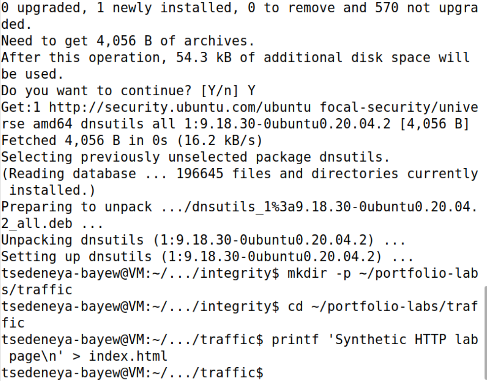
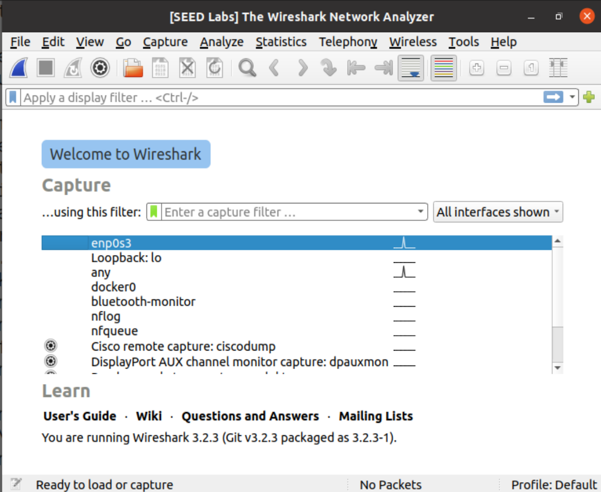
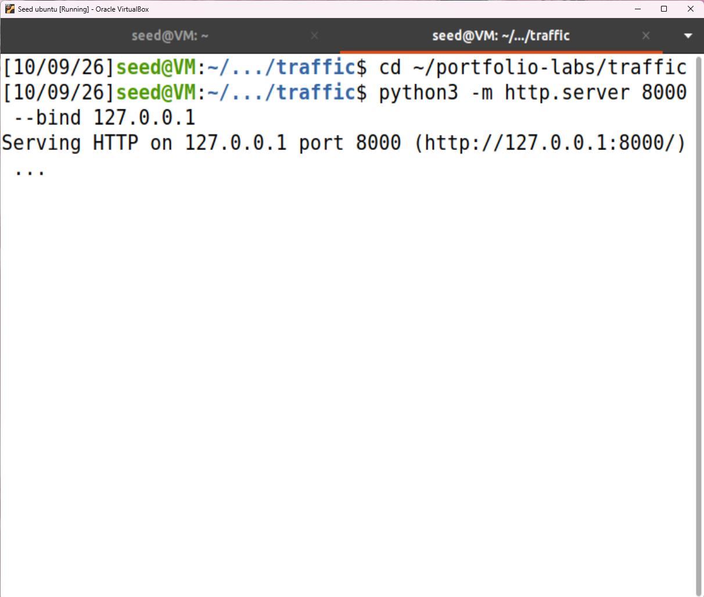
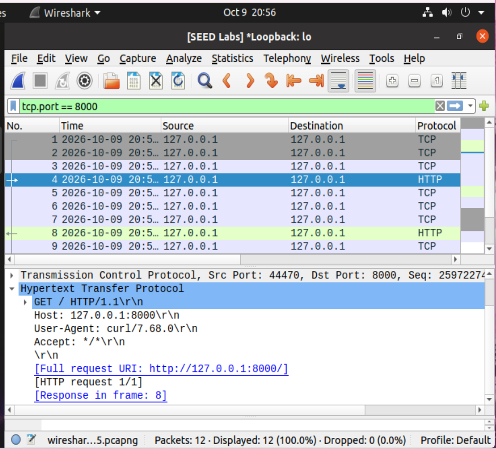
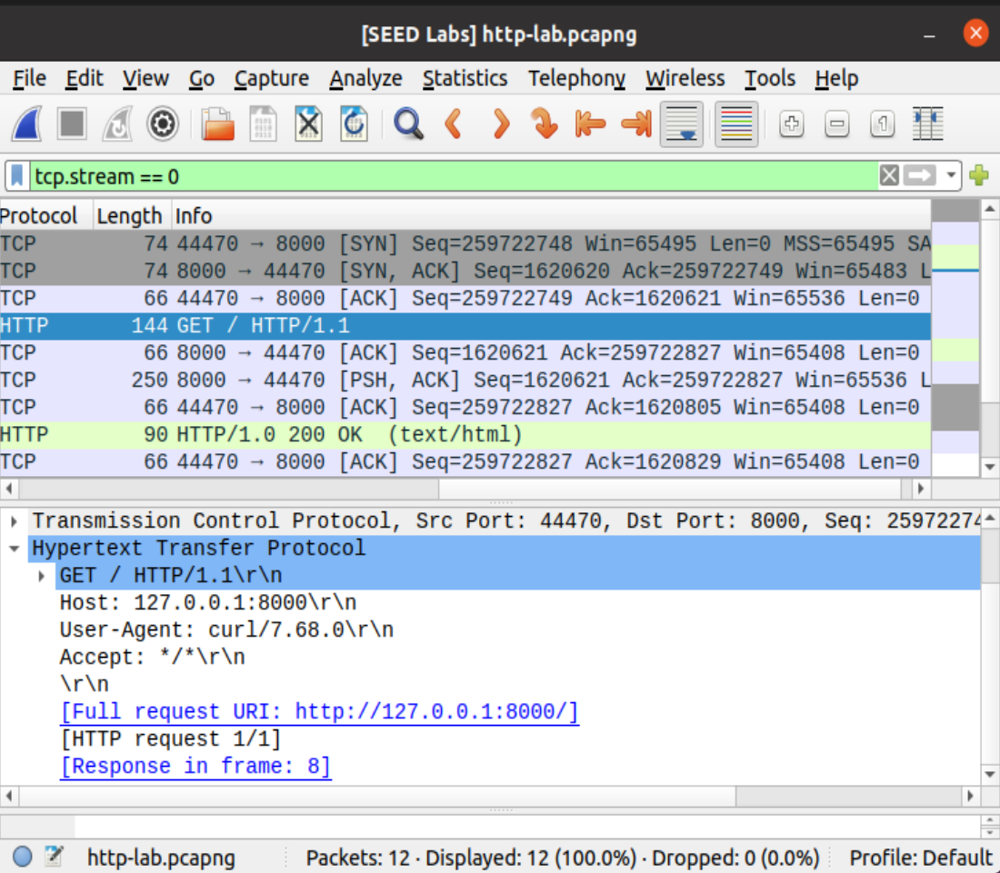
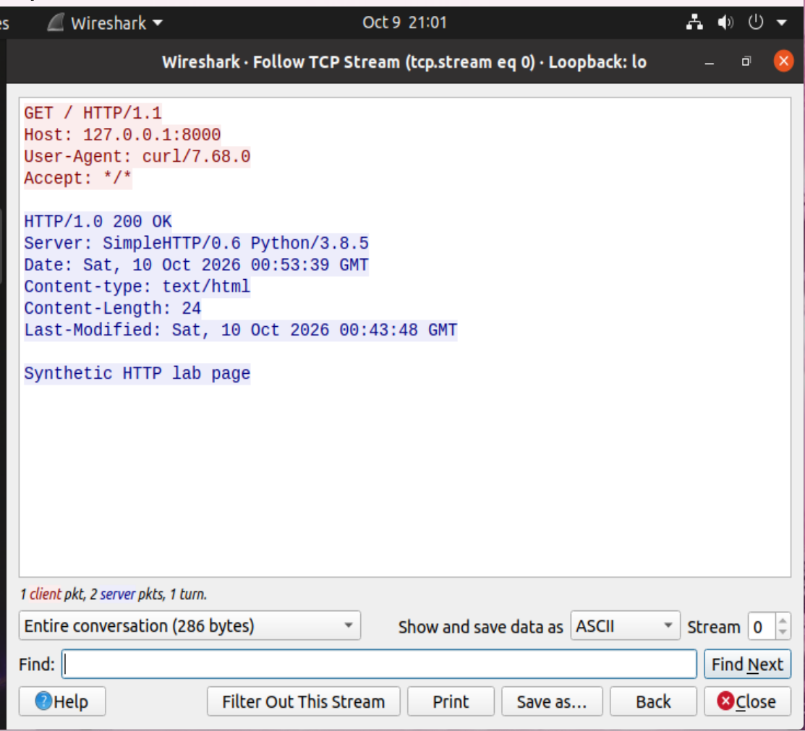
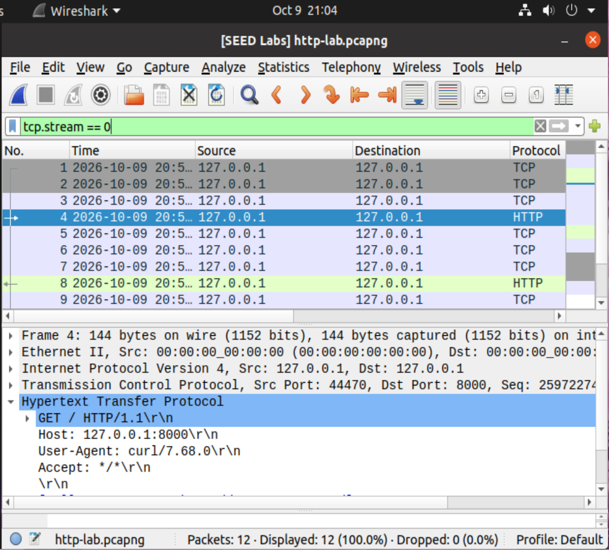

# Wireshark Traffic Analysis

**Level:** Beginner · **Suggested time:** 1–2 hours · **Status:** In progress

> Lab in progress. Steps 1–4 are documented, including the HTTP response, TCP handshake, reconstructed stream, and local capture save. DNS analysis and final summary/cleanup (Steps 5–6) remain pending.

[← Project index](../../README.md)

## Objective

Complete a reproducible wireshark traffic analysis exercise, validate the behavior, and explain the evidence and limitations in a professional report.

## Environment and prerequisites

Ubuntu desktop VM; Wireshark, Python 3, curl, and dnsutils. Use synthetic HTTP on loopback; DNS queries contain no sensitive data.

## How to use this repository

1. Read the environment and scope before starting. Use a disposable VM for administrative changes.
2. Follow steps in order. Record actual output; expected results are predictions, not completed evidence.
3. Save screenshots using the exact filenames shown below in `screenshots/`.
4. Add each image under its step using ``. Setup evidence is included below; add the remaining screenshots as you complete the lab.
5. Complete [your findings report](reports/findings.md). Record deviations and failed checks honestly.
6. Change **Not started** to **In progress** when you begin. Mark **Completed** only after your evidence and report are committed.

For browser uploads: open the destination folder → Add file → Upload files → select your sanitized files → Commit changes. To edit Markdown: open the file → pencil icon → edit → preview → commit with a descriptive message. Do not upload passwords, tokens, personal identifiers, or unrelated logs.

## Step-by-step lab

### 1. Install and prepare

```bash
sudo apt update
sudo apt install wireshark curl dnsutils python3
mkdir -p ~/portfolio-labs/traffic
cd ~/portfolio-labs/traffic
printf 'Synthetic HTTP lab page\n' > index.html
```
During Wireshark package setup, permit non-root capture if prompted. Add your VM user with `sudo usermod -aG wireshark "$USER"` and log out and back in. Launch Wireshark without sudo. Capture only your own lab traffic.



**Observed result:** The screenshot shows `dnsutils` version `1:9.18.30-0ubuntu0.20.04.2` being unpacked and configured. Commands create `~/portfolio-labs/traffic`, change into it, and write `Synthetic HTTP lab page` to `index.html`, with no visible errors. This setup screenshot does not establish capture permissions; the additional screenshot below verifies interface availability.

**Screenshot checkpoint:** 01-interfaces.png: available Wireshark interfaces.



**Observed result:** Wireshark 3.2.3 (packaged as 3.2.3-1) opens and lists `enp0s3`, `Loopback: lo`, `any`, and other interfaces. The status shows `No Packets`; successful capture has not yet been tested. Step 1 preparation and interface inspection are documented. Use `Loopback: lo` for the local HTTP exercise, rather than the currently highlighted `enp0s3`.

### 2. Start a local web server

```bash
cd ~/portfolio-labs/traffic
python3 -m http.server 8000 --bind 127.0.0.1
```
Leave this terminal running. Binding to 127.0.0.1 makes the service local to the VM; it is not exposed to the network.

**Screenshot checkpoint:** 02-server.png: server bound to loopback.



**Observed result:** The screenshot shows `python3 -m http.server 8000 --bind 127.0.0.1` reporting `Serving HTTP on 127.0.0.1 port 8000`. The server is running on the VM's loopback address. No HTTP request or capture is shown yet. Leave this terminal running while generating traffic from another terminal.

### 3. Capture HTTP on loopback

In Wireshark, double-click `lo` (loopback). In a second terminal run:
```bash
curl http://127.0.0.1:8000/
```
Stop capture. Enter the display filter `tcp.port == 8000`. If HTTP is not decoded, select a packet, use Analyze → Decode As, and select HTTP for TCP port 8000. Inspect request method, response status, TCP source/destination ports, and the three-way handshake.

**Screenshot checkpoint:** 03-http.png: filtered packets and a request or response detail.



**Observed result:** On `Loopback: lo`, the applied display filter is `tcp.port == 8000`. Frame 4 shows `GET / HTTP/1.1`, Host `127.0.0.1:8000`, User-Agent `curl/7.68.0`, and Accept `*/*`. TCP source port is `44470` and destination port is `8000`; both IP addresses are `127.0.0.1`. Wireshark links the response to frame 8. The status bar reports 12 captured and displayed packets and 0 dropped. The Step 4 stream screenshot below confirms the response status as `HTTP/1.0 200 OK`. The additional handshake screenshot below verifies the three-way handshake.



**Handshake verification:** With `tcp.stream == 0`, the first three rows show client `44470 → 8000 [SYN]`, server `8000 → 44470 [SYN, ACK]`, and client `44470 → 8000 [ACK]`, followed by the GET request. The client's initial sequence number `259722748` is acknowledged as `259722749`; the server's `1620620` is acknowledged as `1620621`. Each SYN consumes one sequence number, consistent with TCP connection establishment. The packet list also shows `HTTP/1.0 200 OK`.

### 4. Reconstruct the conversation

Select an HTTP packet and choose Follow → TCP Stream. Find the GET request and synthetic response body. Record which port is the server port and which is the temporary client port. Save this loopback-only capture locally as `http-lab.pcapng`.

**Screenshot checkpoint:** 04-stream.png: synthetic request and response.



**Observed result:** Follow TCP Stream shows stream 0 in ASCII: `GET / HTTP/1.1` and the server response `HTTP/1.0 200 OK`. The response advertises `SimpleHTTP/0.6 Python/3.8.5`, `Content-type: text/html`, and `Content-Length: 24`; its body is `Synthetic HTTP lab page`. The readable request and response demonstrate plaintext HTTP within this local lab. The entire conversation is 286 bytes of stream data; this is not the size of the packet capture. The earlier packet details identify server port `8000` and client port `44470`. The additional screenshot below shows `http-lab.pcapng` open in Wireshark, documenting the local save.



**Capture save evidence:** Wireshark's title and status bar show `http-lab.pcapng`; `tcp.stream == 0` displays all 12 captured packets with 0 dropped. The screenshot shows frame 4 selected. The Info column is hidden in this save screenshot; the Step 3 handshake screenshot separately verifies the flags. The PCAP remains local; it has not been uploaded or independently reviewed.

### 5. Capture a small DNS sample

Start a new capture on the VM's active NAT interface (find it with `ip route`). Run:
```bash
dig example.com
```
Stop capture and apply `dns`. Compare query and response transaction IDs and the query name. If the resolver is local, DNS may appear on loopback instead; inspect `resolvectl status` and capture the appropriate interface. If there is no response, record that accurately.

**Screenshot checkpoint:** 05-dns.png: query and response, if available.

### 6. Summarize and clean up

Create a table of protocol, source, destination, ports, and meaning for the synthetic exchange. Explain HTTP plaintext versus HTTPS encryption; do not infer that ordinary HTTPS reveals page contents. Stop the Python server using Ctrl+C. Review any packet capture before sharing; raw captures can contain other traffic.

**Screenshot checkpoint:** 06-summary.png: protocol table or capture statistics.

## Troubleshooting

No packets usually means wrong interface or capture permissions. A display filter only hides packets after capture; it does not limit what is recorded. Avoid browsing personal sites while capturing.

## Questions to answer in your report

- What is the difference between capture and display filters?
- Why are client ports temporary?
- What can be observed when payloads are encrypted?

## Completion checklist

- [ ] Environment and exact scope recorded
- [ ] All lab steps attempted and actual outcomes documented
- [ ] Screenshots uploaded and linked under their steps
- [ ] Findings distinguish observation from interpretation
- [ ] Limitations and remediation explained
- [ ] Cleanup or restoration completed
- [ ] Findings report completed; status updated in this repository and portfolio index

## Official references

- https://www.wireshark.org/docs/wsug_html/
- https://wiki.wireshark.org/DisplayFilters/
