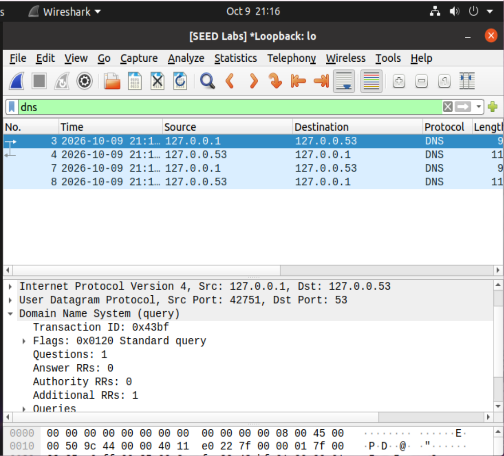

# Wireshark Traffic Analysis — Findings Report

**Status:** In progress  
**Started:** October 9, 2026 (first screenshot submitted)  
**Completed:** Not yet completed

> Partial findings report. Steps 1–4 are documented, including handshake verification and the local capture save. Initial DNS query evidence is documented; query-name and response verification plus final summary/cleanup remain pending.

## Progress summary

The supplied screenshot documents dnsutils installation and synthetic page preparation. An additional screenshot shows Wireshark 3.2.3 and available interfaces, including loopback. Step 2 shows the Python HTTP server running on 127.0.0.1:8000. Step 3 shows a captured loopback HTTP GET request and TCP ports. Step 4 reconstructs the request and a `200 OK` response containing the synthetic page. The saved capture is shown as `http-lab.pcapng`. The additional packet-list screenshot verifies the TCP three-way handshake. Step 5 shows a DNS query to a local resolver; query-name and response verification and cleanup remain pending.

## Environment and authorized scope

| Item | Observed value |
|---|---|
| Environment | User's Ubuntu lab VM; exact OS release not shown in this screenshot |
| Package | dnsutils 1:9.18.30-0ubuntu0.20.04.2 |
| Prompt | tsedeneya-bayew@VM, customized display |
| Working directory | ~/portfolio-labs/traffic specified by the commands |
| Synthetic artifact | index.html, created using printf with Synthetic HTTP lab page and a newline |
| Scope | Captured local loopback HTTP; planned example.com DNS lab |
| Wireshark | 3.2.3, Git v3.2.3 packaged as 3.2.3-1 |
| Interfaces shown | enp0s3, Loopback: lo, any, docker0, bluetooth-monitor, nflog, nfqueue; remote capture entries also visible |
| Server version header | SimpleHTTP/0.6 Python/3.8.5 advertised in HTTP response; not an independent version check |

## Evidence log

| Step | Action | Actual result | Evidence | Interpretation |
|---|---|---|---|---|
| 1 setup | Package installation output | dnsutils unpacking and Setting up messages; prompt returns | [Setup screenshot](../screenshots/01-setup.png) | dnsutils setup shown completing without a visible error. |
| 1 setup | mkdir -p and cd to traffic directory | No visible errors; prompt ends in traffic | [Setup screenshot](../screenshots/01-setup.png) | Lab directory preparation recorded. |
| 1 setup | printf redirected to index.html | No visible error | [Setup screenshot](../screenshots/01-setup.png) | Synthetic page creation command recorded; Step 4 later shows the page text in the HTTP response. |
| 1 interfaces | Open Wireshark and inspect welcome screen | Version 3.2.3; enp0s3 and Loopback: lo listed; No Packets | [Interface screenshot](../screenshots/01-interfaces.png) | Interface availability verified; capture success remains untested. |
| 2 | cd to traffic directory; python3 -m http.server 8000 --bind 127.0.0.1 | Serving HTTP on 127.0.0.1 port 8000 | [Server screenshot](../screenshots/02-server.png) | Server startup on loopback recorded; requests not yet shown. |
| 3 | Capture on Loopback: lo; apply tcp.port == 8000; inspect frame 4 | GET / HTTP/1.1; Host 127.0.0.1:8000; source port 44470, destination port 8000 | [HTTP screenshot](../screenshots/03-http.png) | Local client request to lab server captured and decoded. |
| 3 | Inspect HTTP headers and capture status | User-Agent curl/7.68.0; Accept */*; response linked to frame 8; 12 packets displayed, 0 dropped | [HTTP screenshot](../screenshots/03-http.png) | Plaintext request headers visible; response status and body not shown. |

| 4 | Follow TCP Stream, stream 0, ASCII | GET / HTTP/1.1; HTTP/1.0 200 OK; Content-Length: 24; Synthetic HTTP lab page | [Stream screenshot](../screenshots/04-stream.png) | Successful local HTTP exchange and readable plaintext response reconstructed. |

| 4 save | Save capture locally; display tcp.stream == 0 | Title and status bar show http-lab.pcapng; 12 displayed packets; 0 dropped | [Saved capture screenshot](../screenshots/04-saved-capture.png) | Local save documented; handshake verified in separate evidence. |

| 3 handshake | Inspect Info column for stream 0 | Client SYN, server SYN/ACK, client ACK; sequence acknowledgments each increment the SYN sequence by one | [Handshake screenshot](../screenshots/03-handshake.png) | TCP three-way handshake verified before GET. |

| 5 partial | Capture loopback DNS; inspect frame 3 | UDP 127.0.0.1:42751 → 127.0.0.53:53; standard query; ID 0x43bf; one question | [DNS query screenshot](../screenshots/05-dns-query.png) | Local resolver query captured; query name and matching response details remain unverified. |

## Observations and limitations

Only dnsutils setup is visible in the installation excerpt; the interface screenshot separately establishes Wireshark availability. Python 3 successfully starts its HTTP server in Step 2; the Step 4 response advertises Python/3.8.5, but no independent version command is shown. The captured HTTP User-Agent advertises curl/7.68.0; no independent curl version command was captured. The package summary lists 570 packages not upgraded, which alone does not establish vulnerability or patch status. Wireshark interfaces are visible, including loopback. The Python server reports startup on loopback port 8000. Step 3 establishes successful packet capture on loopback and a decoded HTTP request. It does not establish the privilege configuration used to capture. DNS response details remain unverified. The initial DNS screenshot shows a local resolver exchange on loopback, rather than the proposed NAT-interface capture. Exact exit codes are not shown.

### Loopback request inspection

The client request goes from 127.0.0.1:44470 to 127.0.0.1:8000. Port 8000 is the lab server port; 44470 is the client port for this observed exchange. The HTTP request headers are visible in plaintext. Frame 8 is identified as the corresponding response. Step 4's reconstructed stream confirms `HTTP/1.0 200 OK` and the body `Synthetic HTTP lab page`. The additional handshake screenshot shows the first three rows as `44470 → 8000 [SYN]`, `8000 → 44470 [SYN, ACK]`, and `44470 → 8000 [ACK]`. The client sequence number 259722748 is acknowledged as 259722749; the server sequence number 1620620 is acknowledged as 1620621. This verifies connection establishment before the HTTP request. Wireshark reports zero dropped packets for this capture; no raw capture has been reviewed or uploaded.

### Reconstructed HTTP conversation

The stream view displays the request and response as readable ASCII. The request uses HTTP/1.1; the response uses HTTP/1.0 and status 200 OK. Response headers show `Content-type: text/html` and `Content-Length: 24`, consistent with the synthetic page text plus its newline. Wireshark shows an entire conversation of 286 bytes; this counts stream data, not total packet bytes or PCAP file size. This demonstrates that this HTTP exchange is readable in plaintext. It does not establish the contents of an HTTPS exchange. The screenshot's **Save as…** button exports stream data; saving the packet capture requires the main Wireshark window's File → Save As. The subsequent screenshot shows `http-lab.pcapng` open in Wireshark, documenting the local save. Its title and status bar show the filename; the raw file itself has not been uploaded or independently reviewed.

### Initial DNS inspection

The DNS display filter shows frames 3, 4, 7, and 8 with alternating directions between 127.0.0.1 and 127.0.0.53. The selected query uses UDP source port 42751 and destination port 53, transaction ID 0x43bf, flags 0x0120, one question, zero answer records, and one additional record. Zero answers is expected in a query; it is not proof of failure. The Queries section is collapsed and the Info column is off-screen, so the queried name/type cannot yet be confirmed. Reverse-direction packets alone do not establish a successful answer or matching transaction ID. The screenshot documents the VM's local resolver leg; it does not show which upstream DNS server the resolver used.

## Deviations and troubleshooting

No visible error. The first screenshot documented preparation; the additional interface screenshot now satisfies the interface checkpoint. enp0s3 is highlighted, but the local HTTP exercise requires Loopback: lo.

## Validation and remaining work

- [x] Document dnsutils setup and synthetic page creation commands
- [x] Step 1: prepare the lab and inspect Wireshark interfaces
- [x] Verify successful loopback capture in Step 3
- [x] Step 2: start loopback HTTP server
- [x] Step 3: capture and inspect HTTP request and ports
- [x] Step 3: verify HTTP response status through reconstructed stream
- [x] Step 3: verify SYN, SYN/ACK, and ACK handshake flags
- [x] Step 4: reconstruct TCP conversation and verify synthetic response
- [x] Step 4: document local capture saved as http-lab.pcapng
- [ ] Step 5: inspect DNS query and response
- [ ] Step 6: summarize results and stop server

## Cleanup / restoration

The Python server is running in the Step 2 screenshot; later screenshots document its captured HTTP exchange. Server shutdown remains pending for Step 6. The user retains the lab VM for future projects.
