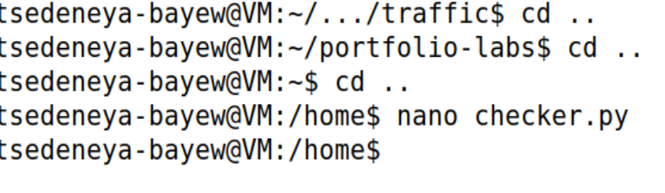
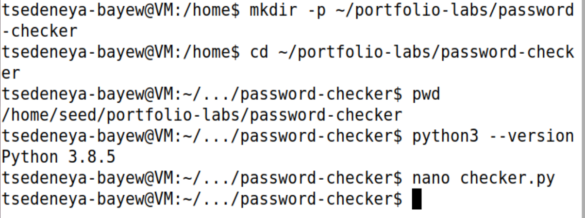

# Python Password Strength Checker

**Level:** Beginner · **Suggested time:** 1–2 hours · **Status:** In progress

> Lab started October 9, 2026. Step 1 is verified: project directory and Python 3.8.5 are documented. Implementation and testing remain pending.

[← Project index](../../README.md)

## Objective

Complete a reproducible python password strength checker exercise, validate the behavior, and explain the evidence and limitations in a professional report.

## Environment and prerequisites

Python 3 on Ubuntu or Windows. Use only invented test strings. This educational heuristic is not an entropy estimator or a production password policy.

## How to use this repository

1. Read the environment and scope before starting. Use a disposable VM for administrative changes.
2. Follow steps in order. Record actual output; expected results are predictions, not completed evidence.
3. Save screenshots using the exact filenames shown below in `screenshots/`.
4. Add each image under its step using ``. Initial setup evidence is included below.
5. Complete [your findings report](reports/findings.md). Record deviations and failed checks honestly.
6. Change **Not started** to **In progress** when you begin. Mark **Completed** only after your evidence and report are committed.

For browser uploads: open the destination folder → Add file → Upload files → select your sanitized files → Commit changes. To edit Markdown: open the file → pencil icon → edit → preview → commit with a descriptive message. Do not upload passwords, tokens, personal identifiers, or unrelated logs.

## Step-by-step lab

### 1. Prepare the project

On Ubuntu, prepare a project folder inside your own home directory:

```bash
mkdir -p ~/portfolio-labs/password-checker
cd ~/portfolio-labs/password-checker
pwd
python3 --version
nano checker.py
```

On Windows, create a lab folder in your user directory and confirm Python with `py --version`. No third-party packages are needed. Save the Step 2 implementation in `checker.py`.

**Screenshot checkpoint:** 01-environment.png: Python version and project folder.



**Observed result and correction:** Three `cd ..` commands move from the earlier traffic folder to `/home`, then `nano checker.py` returns to the shell. `/home` is the parent of user home directories; it is not the intended project directory. This screenshot does not show a saved file, its contents, or the Python version. Run the setup commands above to work in `~/portfolio-labs/password-checker`. No sudo is needed for this project. The corrected setup is verified below.



**Verified setup:** `pwd` prints `/home/seed/portfolio-labs/password-checker`, and `python3 --version` prints `Python 3.8.5`. The directory creation and navigation show no visible errors. `nano checker.py` returns to the shell, but the screenshot does not establish saved contents; Step 2 will verify the implementation. The customized prompt does not change the actual home directory `/home/seed`.

### 2. Implement the checker

Copy into `checker.py`:
```python
import getpass

COMMON = {'password', 'password123', '123456', 'qwerty'}

def evaluate(value):
    messages = []
    if len(value) < 15:
        messages.append('Use at least 15 characters for this lab heuristic.')
    if value.casefold() in COMMON:
        messages.append('Avoid common passwords.')
    if value and len(set(value)) == 1:
        messages.append('Avoid repeating one character.')
    if not value:
        messages.append('Input is empty.')
    return messages

if __name__ == '__main__':
    password = getpass.getpass('Invented test password: ')
    findings = evaluate(password)
    print('\n'.join(findings) if findings else
          'No issue found by this limited heuristic; strength is not guaranteed.')
```
`getpass` avoids displaying input. `casefold` allows case-insensitive matching. The function returns explanations rather than logging the password. A tiny common-password list is illustrative, not complete.

**Screenshot checkpoint:** 02-code.png: implementation without entered passwords.

### 3. Run controlled examples

Run `python3 checker.py` (Windows: `py checker.py`). Test an empty input, an invented short string, a repeated-character string, and an invented phrase of 15 or more characters. Enter no real passwords. Record the category and output, not the entered value.

**Screenshot checkpoint:** 03-output.png: heuristic feedback only.

### 4. Add automated checks

Create `test_checker.py`:
```python
import unittest
from checker import evaluate

class CheckerTests(unittest.TestCase):
    def test_empty_is_rejected(self):
        self.assertTrue(evaluate(''))
    def test_common_is_flagged(self):
        self.assertTrue(any('common' in x for x in evaluate('PASSWORD')))
    def test_repeated_is_flagged(self):
        self.assertTrue(any('repeating' in x for x in evaluate('z' * 20)))
    def test_long_phrase_has_no_heuristic_issue(self):
        self.assertEqual(evaluate('synthetic river lantern trail'), [])

if __name__ == '__main__':
    unittest.main()
```
Run `python3 -m unittest -v` or `py -m unittest -v`. A passing test suite checks behavior, not real-world password security.

**Screenshot checkpoint:** 04-tests.png: four passing tests.

### 5. Evaluate limitations

Explain that length and an example blocklist do not measure predictability, leaked-password reuse, personal information, or credential stuffing. Do not require arbitrary character-class rules as proof of strength. Discuss MFA, password managers, and checking a comprehensive compromised-password blocklist without transmitting raw passwords.

**Screenshot checkpoint:** 05-limitations.png: report excerpt.

### 6. Publish the implementation

Add your actual `checker.py` and `test_checker.py` to `src/` after running them. Include Python version, test output, changes you made, and limitations in `reports/findings.md`. Never include test inputs copied from actual credentials.

**Screenshot checkpoint:** 06-summary.png: sanitized repository file view.

## Troubleshooting

If getpass warns that input may be echoed, run in a normal terminal rather than an unsupported notebook or editor panel. For unittest imports, keep both files together and run from that folder.

## Questions to answer in your report

- Why is character count not the same as entropy?
- Why should passwords never appear in logs?
- What would a production checker need beyond this example?

## Completion checklist

- [ ] Environment and exact scope recorded
- [ ] All lab steps attempted and actual outcomes documented
- [ ] Screenshots uploaded and linked under their steps
- [ ] Findings distinguish observation from interpretation
- [ ] Limitations and remediation explained
- [ ] Cleanup or restoration completed
- [ ] Findings report completed; status updated in this repository and portfolio index

## Official references

- https://docs.python.org/3/library/getpass.html
- https://docs.python.org/3/library/unittest.html
