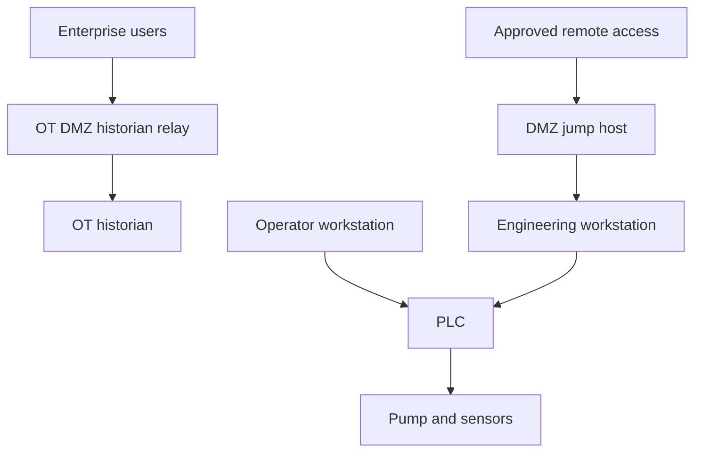

# OT/ICS Threat Modeling

**Level:** Advanced · **Suggested time:** 1–2 days · **Status:** Not started

> Prepared lab guide. No execution, screenshots, or findings are claimed yet.

[← Portfolio index](https://github.com/tsedeneya-bayew/cybersecurity-portfolio)

## Objective

Complete a reproducible ot/ics threat modeling exercise, validate the behavior, and explain the evidence and limitations in a professional report.

## Environment and prerequisites

Markdown editor and a fictional water-pumping facility scenario. No industrial device access, scanning, protocol exploitation, or live plant changes. This is a design and tabletop analysis project.

## How to use this repository

1. Read the environment and scope before starting. Use a disposable VM for administrative changes.
2. Follow steps in order. Record actual output; expected results are predictions, not completed evidence.
3. Save screenshots using the exact filenames shown below in `screenshots/`.
4. Add each image under its step using ``. No images are included yet.
5. Complete [your findings report](reports/findings.md). Record deviations and failed checks honestly.
6. Change **Not started** to **In progress** when you begin. Mark **Completed** only after your evidence and report are committed.

For browser uploads: open the destination folder → Add file → Upload files → select your sanitized files → Commit changes. To edit Markdown: open the file → pencil icon → edit → preview → commit with a descriptive message. Do not upload passwords, tokens, personal identifiers, or unrelated logs.

## Step-by-step lab

### 1. Define the fictional process

Scenario: a pumping facility uses an operator workstation, engineering workstation, historian, PLC, and pump sensors. Remote maintenance passes through an approved access service. List assets, owners by role, availability needs, and safety constraints. State assumptions rather than treating the scenario as a surveyed real plant.

**Screenshot checkpoint:** 01-assets.png: fictional asset and process inventory.

### 2. Draw data flows and boundaries

Create a Mermaid flowchart:

Label allowed direction, purpose, authentication, and boundary for each flow in a separate table. The arrows are a proposed design, not proof of enforced segmentation.

**Screenshot checkpoint:** 02-boundaries.png: rendered diagram and flow table.

### 3. Identify threats and consequences

For each boundary, analyze identity spoofing, unauthorized changes, loss of auditability, information exposure, service disruption, and privilege misuse. Include compromised remote access, unauthorized engineering changes, historian manipulation, and loss of operator visibility. Explain physical-process consequences cautiously; do not invent device-specific safety behavior.

**Screenshot checkpoint:** 03-threats.png: threat, affected asset, preconditions, consequence.

### 4. Prioritize with a transparent rubric

Use qualitative likelihood and consequence ratings, with evidence and assumptions. Assess safety, availability, environmental, and business effects separately. Record uncertainty; avoid assigning precise probabilities without data. Identify the top three scenarios and their reasoning.

**Screenshot checkpoint:** 04-priorities.png: top risks and rationale.

### 5. Design feasible controls

Map each high-priority scenario to controls: approved remote access with MFA and session logging; least-privilege engineering accounts; network allowlists between defined zones; protected backups and configuration baselines; passive monitoring; tested recovery. Explain owner, implementation dependency, validation method, and operational tradeoff. Patching must follow vendor compatibility and change-management requirements.

**Screenshot checkpoint:** 05-controls.png: risk-to-control mapping.

### 6. Run a tabletop and report

Tabletop: remote access account is compromised while a pump is operating. Write decision points for security analyst, operator, engineering lead, and incident commander. Preserve safety and process continuity; propose isolation only with operational coordination. Define detection, escalation, containment decision, recovery criteria, and lessons learned. Report this as a theoretical analysis, not a tested industrial control deployment.

**Screenshot checkpoint:** 06-tabletop.png: decisions and recovery criteria.

## Troubleshooting

A diagram alone is not a threat model; add asset, flow, risk, and control evidence tables. If a control would interrupt operations, document the dependency and seek simulated operator review. IT assumptions must not override process safety.

## Questions to answer in your report

- How do safety and availability change response priorities?
- Which boundaries enforce least privilege?
- How would you validate controls without risky active testing?

## Completion checklist

- [ ] Environment and exact scope recorded
- [ ] All lab steps attempted and actual outcomes documented
- [ ] Screenshots uploaded and linked under their steps
- [ ] Findings distinguish observation from interpretation
- [ ] Limitations and remediation explained
- [ ] Cleanup or restoration completed
- [ ] Findings report completed; status updated in this repository and portfolio index

## Official references

- https://www.cisa.gov/resources-tools/resources/ics-recommended-practices
- https://csrc.nist.gov/pubs/sp/800/82/r3/final
